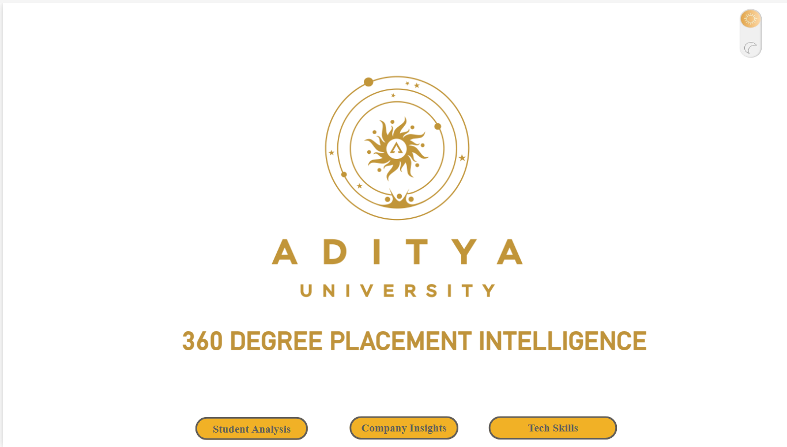
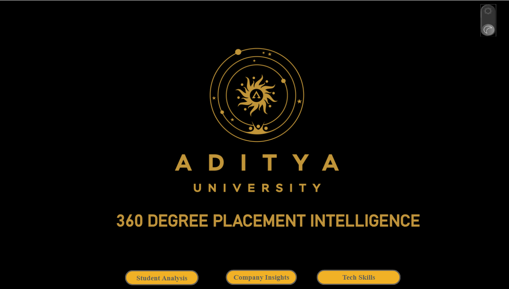

# 360° Placement Intelligence Dashboard

## Project Overview

The 360° Placement Intelligence Dashboard is an interactive Business Intelligence solution developed to analyze student placement trends, certifications, training status, and technology skills.

The dashboard provides a consolidated view of placement-related data and supports data-driven placement planning and decision-making.

## Key Features

- Overall placement and student statistics
- Placement and training analysis
- Certification analysis
- Technology-wise student distribution
- Year-wise certification trends
- Student analysis
- Company insights
- Technology and skill analysis
- Interactive filters and navigation

## Technologies Used

- Microsoft Power BI
- Microsoft Fabric
- Python
- SQL
- Data Analysis and Visualization

## My Contributions

- Performed data preparation and analysis
- Designed the Power BI data model
- Created interactive dashboards and KPIs
- Developed visualizations for placement, certification, training, and technology analysis
- Designed navigation between analytical views
- Derived meaningful insights from placement data
- Implemented interactive navigation and Dark Mode / Light Mode functionality
- Designed a user-friendly dashboard interface for exploring placement insights

## Key Outcome

Developed an interactive dashboard that provides a centralized view of placement-related metrics and enables users to explore trends across students, certifications, companies, training, and technologies.

## Interactive Features

- Dark Mode / Light Mode toggle for an enhanced viewing experience
- Interactive navigation between dashboard sections
- Dynamic filters and slicers for data exploration
- Interactive visualizations and KPIs
- Student, company, certification, and technology analysis

## Dashboard Preview

### Main Dashboard – Light Mode

### Main Dashboard – Dark Mode

### Student Analysis
.png)

### Company Insights
.png)

### Technology Skills
.png)
